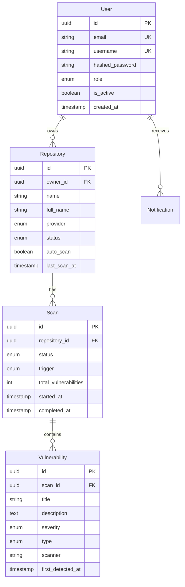

# 🏗️ SecDash アーキテクチャ設計

このドキュメントでは、SecDashの技術アーキテクチャと設計決定について説明します。

---

## 📐 システムアーキテクチャ概要

### 高レベルアーキテクチャ

```
                                  Internet
                                      │
                                      ▼
                            ┌─────────────────┐
                            │  Nginx (80/443) │
                            │  Reverse Proxy  │
                            └────────┬────────┘
                                     │
                     ┌───────────────┴───────────────┐
                     │                               │
                     ▼                               ▼
            ┌─────────────────┐           ┌──────────────────┐
            │  Next.js         │           │   FastAPI        │
            │  Frontend        │◄─────────►│   Backend API    │
            │  (Port 3000)     │   HTTP    │   (Port 8000)    │
            └─────────────────┘           └──────────┬───────┘
                                                      │
                           ┌──────────────────────────┼──────────────────┐
                           │                          │                  │
                           ▼                          ▼                  ▼
                  ┌──────────────┐         ┌──────────────┐   ┌──────────────┐
                  │ PostgreSQL   │         │   Redis      │   │   Ollama     │
                  │ + TimescaleDB│         │  (Cache +    │   │  (Local LLM) │
                  │ (Port 5432)  │         │   Broker)    │   │ (Port 11434) │
                  └──────────────┘         └──────┬───────┘   └──────────────┘
                                                  │
                                                  ▼
                                        ┌──────────────────┐
                                        │ Celery Workers   │
                                        │ + Beat Scheduler │
                                        └─────────┬────────┘
                                                  │
                        ┌─────────────────────────┼─────────────────────┐
                        ▼                         ▼                     ▼
                 ┌─────────────┐         ┌──────────────┐      ┌──────────────┐
                 │  Semgrep    │         │    Trivy     │      │  Gitleaks    │
                 │   (SAST)    │         │ (Container)  │      │  (Secrets)   │
                 └─────────────┘         └──────────────┘      └──────────────┘
```

---

## 🎯 設計原則

### 1. セキュリティファースト
- **原則**: すべての設計決定でセキュリティを最優先
- **実装**:
  - OWASP Top 10 対策
  - デフォルトで安全な設定
  - 最小権限の原則
  - 深層防御 (Defense in Depth)

### 2. スケーラビリティ
- **水平スケーリング**: Celeryワーカーの追加でスキャン処理能力を拡張
- **非同期処理**: 重い処理はバックグラウンドで実行
- **キャッシング**: Redisによる高速レスポンス

### 3. 可用性
- **ヘルスチェック**: 全コンポーネントに実装
- **グレースフルシャットダウン**: データ損失を防ぐ
- **エラーハンドリング**: 包括的なエラー処理と復旧

### 4. 保守性
- **モジュラー設計**: 疎結合なコンポーネント
- **クリーンアーキテクチャ**: 関心の分離
- **テスタビリティ**: 高いテストカバレッジ

---

## 🔧 技術スタック詳細

### フロントエンド

#### Next.js 15 (App Router)
**選定理由**:
- **SSR/SSG**: SEO最適化と初期ロード高速化
- **App Router**: 最新のReactパターン
- **TypeScript**: 型安全性
- **ファイルベースルーティング**: 直感的な構造

**主要ライブラリ**:
```typescript
{
  "react-query": "状態管理とキャッシング",
  "shadcn/ui": "高品質UIコンポーネント",
  "recharts": "データ可視化",
  "zod": "スキーマバリデーション",
  "axios": "HTTPクライアント"
}
```

#### コンポーネント構造
```
components/
├── ui/              # 基本UIコンポーネント (shadcn/ui)
├── dashboard/       # ダッシュボード固有
├── layout/          # レイアウトコンポーネント
└── providers.tsx    # コンテキストプロバイダー
```

### バックエンド

#### FastAPI
**選定理由**:
- **高性能**: Starlette + Uvicornによる非同期処理
- **自動ドキュメント**: OpenAPI/Swagger自動生成
- **型安全**: Pydanticによるバリデーション
- **モダン**: 最新Pythonフィーチャー (async/await, type hints)

**アーキテクチャパターン**:
```
app/
├── api/          # APIエンドポイント (Controller層)
├── core/         # 設定・セキュリティ (Infrastructure層)
├── models/       # データベースモデル (Entity層)
├── schemas/      # Pydanticスキーマ (DTO層)
├── services/     # ビジネスロジック (Service層)
└── workers/      # Celeryタスク (Worker層)
```

#### レイヤーアーキテクチャ

```
┌─────────────────────────────────────┐
│      API Layer (FastAPI Routes)     │
├─────────────────────────────────────┤
│    Service Layer (Business Logic)   │
├─────────────────────────────────────┤
│   Repository Layer (Data Access)    │
├─────────────────────────────────────┤
│    Model Layer (SQLAlchemy ORM)     │
└─────────────────────────────────────┘
```

---

## 💾 データモデル設計

### Entity Relationship Diagram



### データベース設計のポイント

1. **UUID**: プライマリキーにUUIDv4を使用
   - セキュリティ: 予測不可能なID
   - スケーラビリティ: 分散環境でのID衝突回避

2. **TimescaleDB**: 時系列データに最適化
   - スキャン履歴の効率的なクエリ
   - 自動パーティショニング

3. **インデックス戦略**:
   ```sql
   -- 頻繁にクエリされる列
   CREATE INDEX idx_scan_status ON scans(status);
   CREATE INDEX idx_vulnerability_severity ON vulnerabilities(severity);
   CREATE INDEX idx_repository_owner ON repositories(owner_id);
   ```

---

## 🔄 非同期処理アーキテクチャ

### Celery + Redis

```
┌─────────────┐      ┌──────────────┐      ┌─────────────────┐
│   FastAPI   │─────►│    Redis     │◄─────│ Celery Workers  │
│  (Producer) │ Task │ (Message Q)  │ Poll │  (Consumers)    │
└─────────────┘      └──────────────┘      └────────┬────────┘
                                                     │
                                           ┌─────────┴────────┐
                                           │  Execute Scan    │
                                           │  1. Clone Repo   │
                                           │  2. Run Scanners │
                                           │  3. Parse Results│
                                           │  4. Save to DB   │
                                           │  5. Send Notify  │
                                           └──────────────────┘
```

### タスクの種類

1. **スキャンタスク** (長時間実行):
   - リポジトリクローン
   - セキュリティスキャン実行
   - 結果解析

2. **定期タスク** (Celery Beat):
   - スケジュールスキャン
   - 週次レポート生成
   - データクリーンアップ

3. **通知タスク**:
   - Slack/Discord Webhook送信
   - Email送信

---

## 🤖 Ollama統合アーキテクチャ

### LLMワークフロー

```
Vulnerability Data
      │
      ▼
┌─────────────────┐
│ Prompt Template │
│ Engineering     │
└────────┬────────┘
         │
         ▼
  ┌────────────┐
  │   Ollama   │
  │  (HTTP API)│
  └────────┬───┘
           │
    ┌──────┴───────┐
    │              │
    ▼              ▼
┌────────┐    ┌──────────┐
│Summary │    │Fix Code  │
└────────┘    └──────────┘
```

### モデル使い分け

| タスク | モデル | 理由 |
|--------|--------|------|
| 要約生成 | llama3.2 | 高速・軽量 |
| コード修正 | codellama | コード特化 |
| 複雑な分析 | deepseek-coder | 高精度 |

---

## 🔐 セキュリティアーキテクチャ

### 認証フロー

```
┌─────────┐         ┌──────────┐         ┌──────────┐
│ Client  │────────►│  FastAPI │────────►│   Redis  │
│         │  Login  │  /auth   │  Store  │  Session │
└─────────┘         └─────┬────┘         └──────────┘
     ▲                    │
     │                    ▼
     │              ┌──────────┐
     └──────────────│   JWT    │
        Access Token│  Encode  │
                    └──────────┘
```

### 権限管理 (RBAC)

```python
@requires_role("admin")
async def delete_repository():
    pass

@requires_role("user", "admin")
async def create_scan():
    pass

@requires_role("viewer", "user", "admin")
async def view_vulnerabilities():
    pass
```

---

## 📊 スキャナー統合アーキテクチャ

### プラグインパターン

```python
class BaseScanner(ABC):
    @abstractmethod
    async def scan(self, repo_path: str) -> ScanResult:
        pass

class SemgrepScanner(BaseScanner):
    async def scan(self, repo_path: str) -> ScanResult:
        # Semgrep specific logic
        pass

class TrivyScanner(BaseScanner):
    async def scan(self, repo_path: str) -> ScanResult:
        # Trivy specific logic
        pass
```

### 並列スキャン

```python
async def run_all_scanners(repo_path: str):
    scanners = [
        SemgrepScanner(),
        TrivyScanner(),
        GitleaksScanner(),
    ]

    results = await asyncio.gather(
        *[scanner.scan(repo_path) for scanner in scanners]
    )

    return merge_results(results)
```

---

## 🔄 CI/CD パイプライン

```
┌──────────────┐
│  Git Push    │
└──────┬───────┘
       │
       ▼
┌──────────────────┐
│ GitHub Actions   │
├──────────────────┤
│ 1. Lint & Format │
│ 2. Unit Tests    │
│ 3. Security Scan │
│ 4. Build Images  │
│ 5. Push to       │
│    Registry      │
│ 6. Deploy        │
└──────────────────┘
```

---

## 📈 スケーリング戦略

### 水平スケーリング

1. **Celeryワーカー**:
```bash
docker-compose up -d --scale celery_worker=5
```

2. **バックエンドAPI**:
```yaml
backend:
  deploy:
    replicas: 3
  environment:
    - GUNICORN_WORKERS=4
```

### 垂直スケーリング

```yaml
backend:
  deploy:
    resources:
      limits:
        cpus: '2'
        memory: 4G
      reservations:
        cpus: '1'
        memory: 2G
```

---

## 🛡️ 障害対策

### エラーハンドリング

1. **リトライメカニズム** (Celery):
```python
@celery_app.task(bind=True, max_retries=3)
def scan_repository(self, repo_id):
    try:
        # Scan logic
        pass
    except Exception as exc:
        raise self.retry(exc=exc, countdown=60)
```

2. **サーキットブレーカー** (Ollama):
```python
async def call_ollama_with_fallback():
    if ollama_circuit_breaker.is_open():
        return default_response
    try:
        return await call_ollama()
    except Exception:
        ollama_circuit_breaker.record_failure()
        return default_response
```

---

## 📝 まとめ

SecDashは、以下の設計原則に基づいて構築されています:

1. **セキュリティ**: 全レイヤーでセキュリティを考慮
2. **スケーラビリティ**: 水平・垂直スケーリングに対応
3. **保守性**: モジュラー設計と明確な責任分離
4. **パフォーマンス**: 非同期処理とキャッシング戦略
5. **可用性**: エラーハンドリングと監視

---

**関連ドキュメント**:
- [セットアップガイド](SETUP.md)
- [APIリファレンス](API.md)
- [セキュリティポリシー](SECURITY.md)
